## Why

Lakes are changing worldwide due to altered climate. Many lakes that were historically frozen in the winter are now experiencing fewer days of ice cover and earlier ice-off dates.

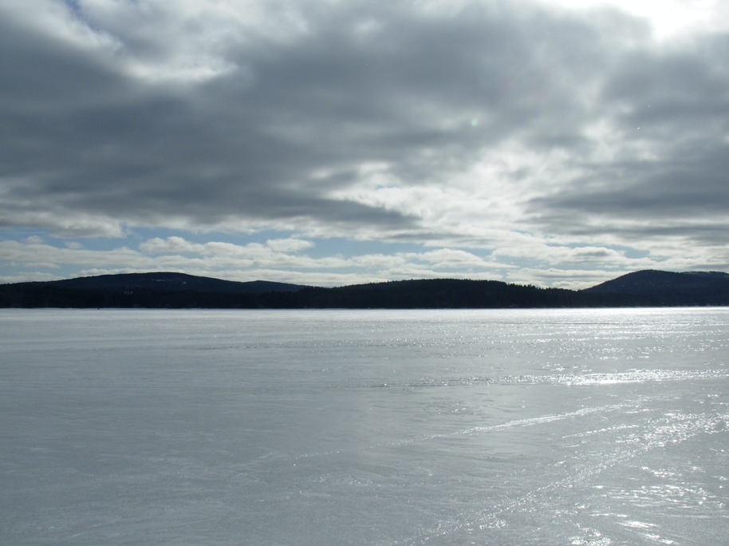{fig-alt="photo of a lake"}

## Phenology

The study of cyclic and seasonal natural phenomena, esp. in relation to climate and plant and animal life

## What is ice-off

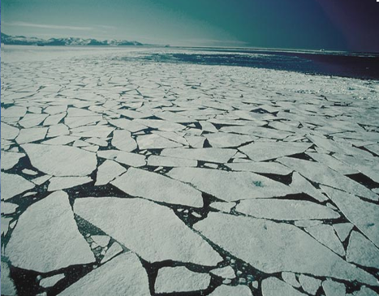{fig-alt="photo of ice breaking up"} 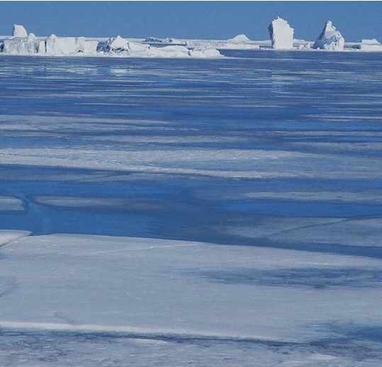{fig-alt="photo of ice breaking up"}

## How does ice melt?

-   During the period of ice cover, snow on the ice both reflects sunlight and insulates the lake. With a thick snow layer, the lake neither gains nor loses heat to the atmosphere. The sediment at the bottom of the lake can actually be a small heat source to the water column over the winter, from stored heat over the summer.
-   In the early spring, as the air warms and solar radiation increases, the snow melts, allowing light to penetrate the ice. The ice can act like glass in a greenhouse, allowing the lake water to warm. As a result, the ice begins to melt from the bottom, not the top.

## How does ice melt? (cont'd)

-   When the ice erodes to a layer between 4 and 12 inches (10-30 cm) thick, it transforms into long vertical crystals called "candles." These candles transmit light very well, so the ice starts to look black.

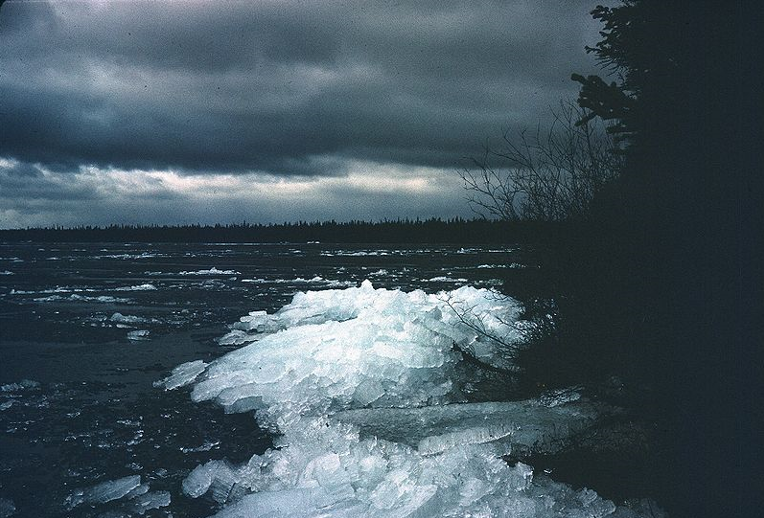{fig-alt="photo of ice candles"}

## How does ice melt? (cont'd)

-   Warming continues, promoting melting of the ice from below because the light energy is being transferred to the water below the ice as heat. Meltwater fills in between the crystals, which begin breaking apart. The surface of the ice begins to appear grey.
-   Finally, the ice thickness decreases further, allowing strong winds to break the surface of the ice apart. The candles will often collect on one side of the lake, making a tinkling sound as they pile up on the shore.

## Why are changes in ice-off dates important ecologically

-   Clearwater phase mismatch
-   Warmer water -\> less dissolved oxygen -\> Bad for cold-water fish that need cold temps and lots of oxygen
-   Less dissolved oxygen and anoxia -\> Increase in P and reduced metals cycling from the sediment
-   Warmer water -\> Increased primary productivity

## How do we measure ice-off?

Day-of-year = 0-365 (or 366) number defining the day since Jan 1 of that year.

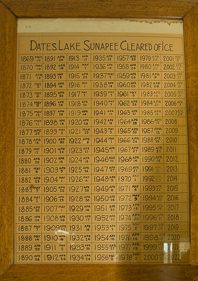{fig-alt="photo Lake Sunapee Ice-off record"}

## Graphing Sunapee dataset

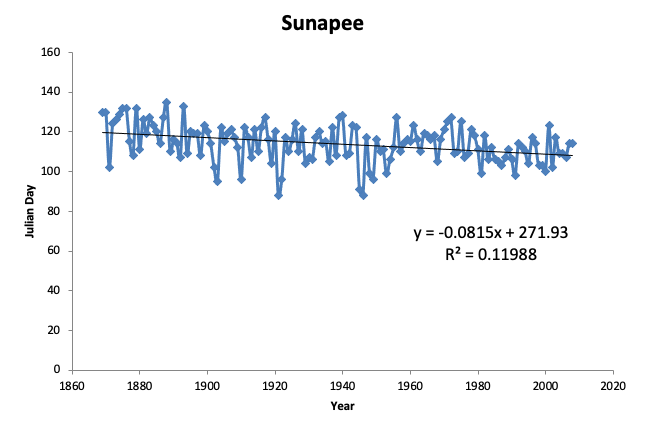{fig-alt="graph of data"}

## Linear regression

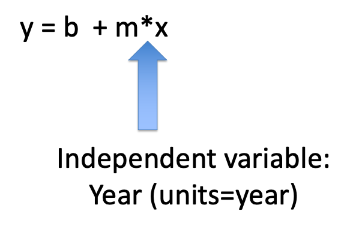{fig-alt="linear regression equation"}

## Linear regression

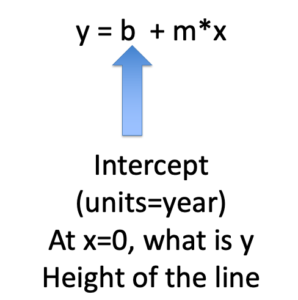{fig-alt="linear regression equation"}

## Linear regression

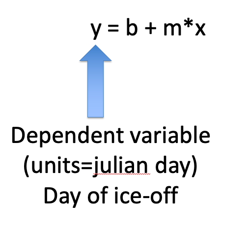{fig-alt="linear regression equation"}

## Linear regression

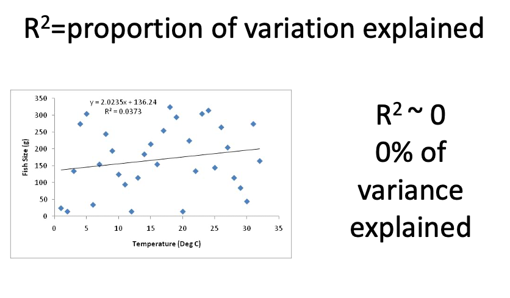{fig-alt="linear regression with r2 of 1"}

## Linear regression

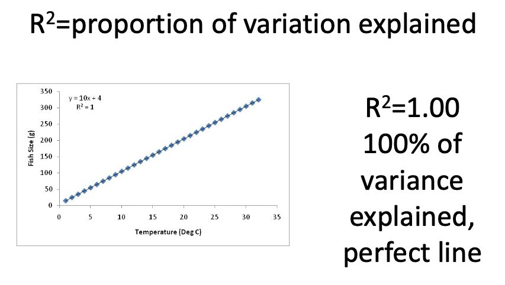{fig-alt="linear regression with r2 of 0"}

## Linear regression

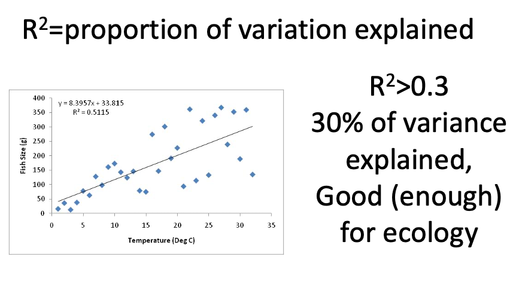{fig-alt="linear regression with r2 of 0.3"}

## Linear regression

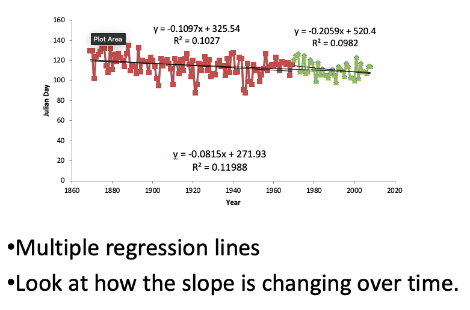{fig-alt="linear regression with two time periods"}

## Key Questions

-   How fast is the date that ice-off occurs changing over time for a focal lake?\

## Data science skills

-   Reading in data from excel files
-   Linear regression
-   Prediction
-   Improved figures: clear title and axis labels

## Assignment

- Your will be submitting *lake-ice-part1* for this assignment. 
- Lake-ice-part2 is Assignment 9 that requires you to pull together skills across to skill in a elegant way

